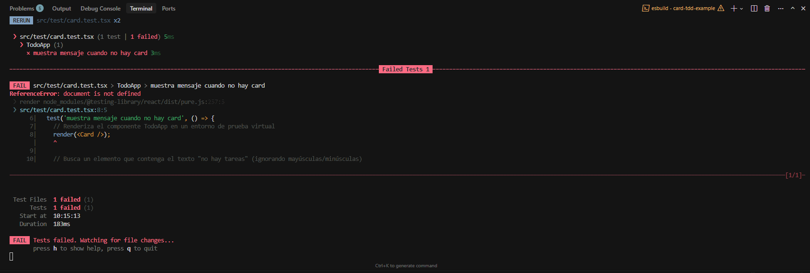
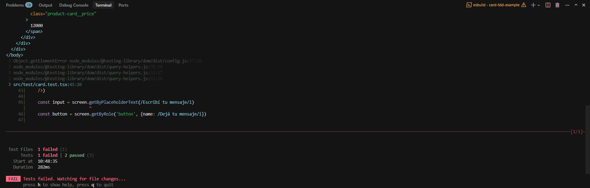
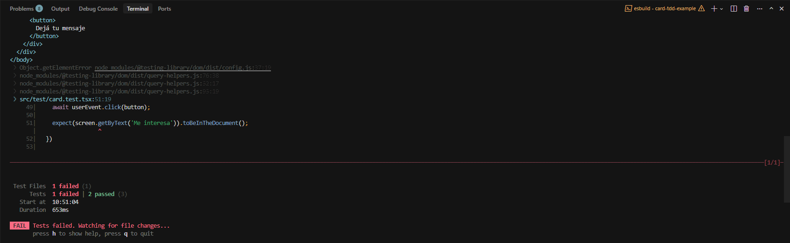
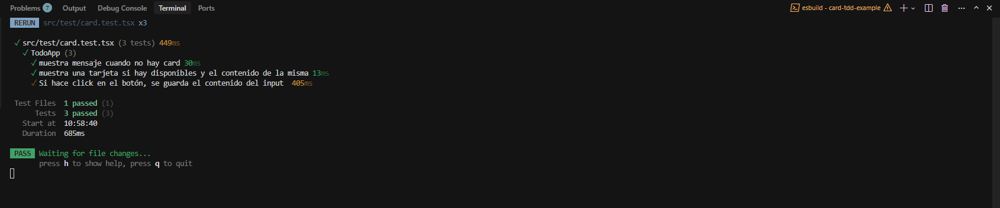

# Proceso TDD - Card de Producto

Este documento muestra el proceso de desarrollo guiado por pruebas (TDD) utilizado para crear un componente Card de producto con React y Vitest.

## Paso 1: Test Inicial - El componente no existe

Escribimos el primer test para verificar que la aplicación muestra un mensaje cuando no hay productos disponibles.

**Estado**: ❌ El test falla porque el componente App aún no está implementado (error: `document is not defined`).

---

## Paso 2: Implementar el mensaje sin productos

Implementamos la lógica básica en App.tsx para mostrar "No hay productos disponibles" cuando el array está vacío.

**Estado**: ✅ El test pasa correctamente. La aplicación renderiza el mensaje esperado.

---

## Paso 3: Agregar test para renderizar productos

Agregamos un segundo test para verificar que cuando hay productos, se muestra la Card con el contenido correcto.

**Estado**: ✅ Ambos tests pasan. La aplicación renderiza correctamente tanto el estado vacío como las cards de productos.

---

## Paso 4: Nuevo test - Input y botón

Agregamos un tercer test para verificar la funcionalidad de guardar mensajes: el usuario escribe en un input y al hacer click en el botón, el mensaje se guarda.

**Estado**: ❌ El test falla porque no existen los elementos `<input>` ni `<button>` en el componente Card.

---

## Paso 5: Agregar input y botón sin funcionalidad

Agregamos el input y el botón al componente Card, pero sin implementar la lógica de guardado.

**Estado**: ❌ El test encuentra los elementos pero falla porque no se guarda el mensaje al hacer click.

---

## Paso 6: Implementar funcionalidad completa

Implementamos el estado con `useState` y la función `handleMessage` para guardar el mensaje y limpiar el input.

**Estado**: ✅ ¡Todos los tests pasan! La funcionalidad está completa y probada.

---

## Ciclo TDD Aplicado

1. **Red** 🔴: Escribir un test que falla
2. **Green** 🟢: Escribir el código mínimo para que pase
3. **Refactor** ♻️: Mejorar el código manteniendo los tests en verde

Este proceso se repitió iterativamente para cada funcionalidad del componente Card.
